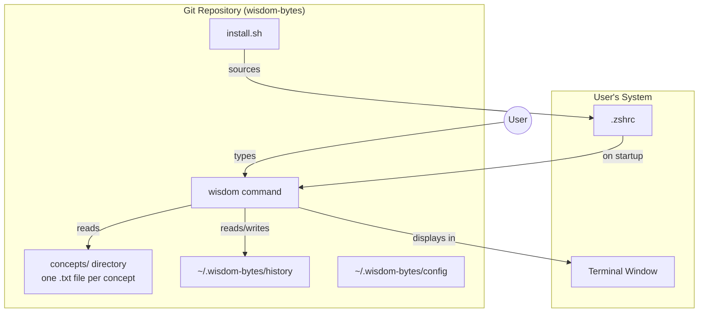
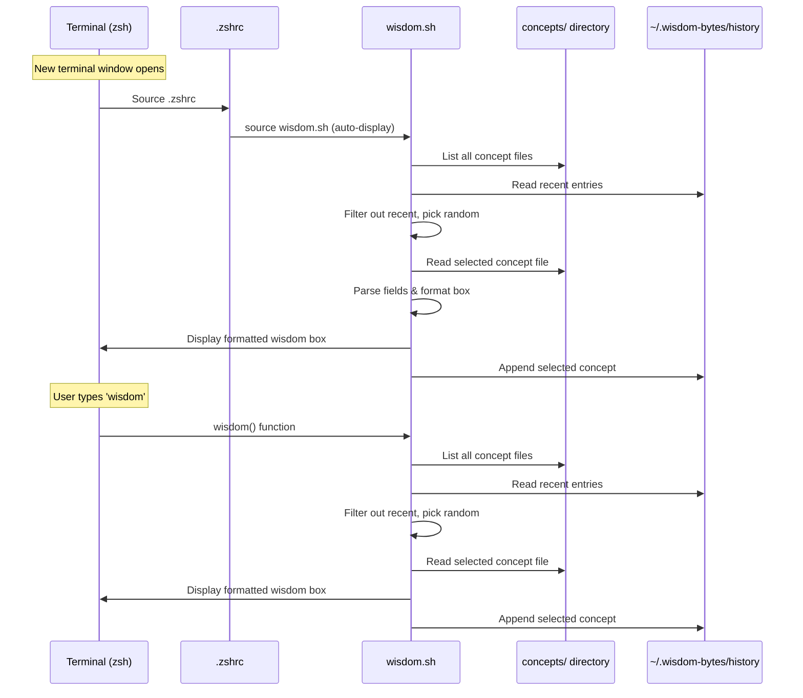
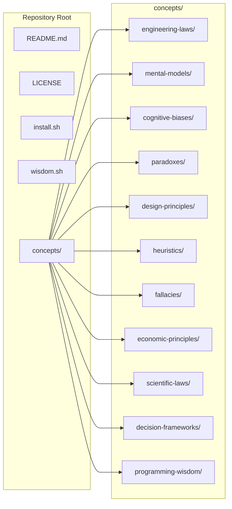

# Wisdom Bytes — Detailed Design

## Overview

**Wisdom Bytes** is a knowledge base of meta-wisdom — engineering laws, mental models, cognitive biases, paradoxes, principles, heuristics, fallacies, and more — stored as simple text files in a git repository. A lightweight zsh script displays one random concept in a formatted box every time a new terminal window opens, with an option to manually invoke it via a `wisdom` command.

The goal: surface humanity's accumulated wisdom during everyday terminal use, turning routine shell starts into micro-lessons.

---

## Detailed Requirements

### Content Scope
- **Engineering laws** (Murphy's, Conway's, Parkinson's, Brooks', etc.)
- **Mental models** (First principles, Inversion, Occam's Razor, Map vs Territory, etc.)
- **Cognitive biases** (Confirmation bias, Dunning-Kruger, Anchoring, etc.)
- **Paradoxes** (Jevons', Abilene, etc.)
- **Design patterns & principles** (DRY, SOLID, KISS, YAGNI, etc.)
- **Heuristics** (Rules of thumb, problem-solving shortcuts)
- **Logical fallacies** (Straw man, false dichotomy, etc.)
- **Economic principles** (Supply/demand, comparative advantage, etc.)
- **Scientific laws & effects** (Moore's Law, Dunbar's Number, Entropy, etc.)
- **Decision-making frameworks** (Eisenhower Matrix, OODA Loop, Cynefin, etc.)
- **Programming/Unix wisdom** (Unix philosophy, naming things, etc.)

### Concept Entry Format
Each concept is stored as a plain text file with the following fields:
- **Name**: The concept name (e.g., "Parkinson's Law")
- **Category**: One of the categories above
- **Description**: Brief definition/explanation
- **Example**: A concrete real-world or hypothetical example
- **Source**: Optional attribution or URL for further reading
- **Tags**: Optional comma-separated keywords for cross-referencing

### Shell Script Behavior
- **Trigger**: Every new terminal window/tab (zsh), plus manual `wisdom` command
- **Display**: Formatted box with emoji, title, description, example, and source
- **Repeat avoidance**: Tracks last N shown concepts in a history file, excludes them from random selection
- **Random selection**: Uniform random across all categories
- **Installation**: Clone repo → run `install.sh` → adds sourcing to `.zshrc`

### Emoji Category Map
| Category | Emoji |
|---|---|
| Engineering Laws | ⚙️ |
| Mental Models | 🧠 |
| Cognitive Biases | 🎯 |
| Paradoxes | 🔄 |
| Design Principles | 📐 |
| Heuristics | 💡 |
| Logical Fallacies | ⚠️ |
| Economic Principles | 📊 |
| Scientific Laws | 🔬 |
| Decision Frameworks | 🗺️ |
| Programming Wisdom | 🖥️ |

### Starting Volume
- 100+ concepts seeded from fs.blog, lawsofsoftwareengineering.com, untools.co, Wikipedia (cognitive biases, fallacies, paradoxes), and other sources
- All entries written in original wording with source attribution

---

## Architecture Overview



### Data Flow



### Directory Structure



---

## Components and Interfaces

### 1. Concept Files (`concepts/<category>/<name>.txt`)

**Interface**: Plain text file with structured fields

```
Name: Parkinson's Law
Category: engineering-laws
Tags: time, management, productivity, work

Work expands so as to fill the time available for its completion.

Example: If you give yourself a week to write a 1-hour presentation, 
it'll take a week. If you give yourself a day, you'll find a way to 
finish it in a day.

Source: https://lawsofsoftwareengineering.com/laws/parkinsons-law/
```

**Parsing rules**:
- First 4 lines are header fields (Name, Category, Tags, blank line)
- After the blank line, the first paragraph is the Description
- After the `Example:` marker, the example text follows
- After the `Source:` marker, the source URL follows
- Lines starting with `Tags:` are comma-separated

### 2. `wisdom.sh` — Core Script

**Interface**: Sourceable zsh script providing:
- `wisdom` function (manual invocation)
- Auto-execution at end of script (for `.zshrc` sourcing)

**Internals**:
- `list_concepts()` — find all `.txt` files in `concepts/` directory
- `read_concept(file)` — parse a concept file into fields
- `pick_random(list, exclude)` — pick random item not in exclude list
- `read_history()` — read recent N entries from history file
- `write_history(name)` — append to history, trim to N entries
- `display_box(concept)` — render formatted box to stdout
- `get_emoji(category)` — return emoji for a category

**Configuration** (via `~/.wisdom-bytes/config`):
- `HISTORY_SIZE=20` — how many recent concepts to skip
- `WISDOM_HOME` — path to wisdom-bytes repo

### 3. `install.sh` — Installation Script

**Interface**: Run once after cloning

**Behavior**:
1. Detect the absolute path of the cloned repo
2. Create `~/.wisdom-bytes/` directory
3. Create empty `history` file
4. Add line to `.zshrc`: `source <repo-path>/wisdom.sh`
5. Check for idempotency (don't add duplicate lines)
6. Print success message and next steps

### 4. History File (`~/.wisdom-bytes/history`)

**Interface**: Simple text file, one concept filename per line

```
parkinsons-law.txt
confirmation-bias.txt
occams-razor.txt
[...up to HISTORY_SIZE lines...]
```

### 5. `~/.wisdom-bytes/config` (Optional)

```
HISTORY_SIZE=20
```

---

## Data Models

### Concept File Schema

| Field | Required | Format | Example |
|---|---|---|---|
| Name | Yes | Plain text, single line | `Parkinson's Law` |
| Category | Yes | Lowercase kebab-case | `engineering-laws` |
| Tags | No | Comma-separated | `time, management, productivity` |
| Description | Yes | Multi-line paragraph | `Work expands...` |
| Example | Yes | Multi-line after `Example:` marker | `If you give yourself...` |
| Source | No | URL | `https://...` |

### History File Schema

| Line | Content |
|---|---|
| 1 | `parkinsons-law.txt` |
| 2 | `confirmation-bias.txt` |
| ... | ... |

---

## Error Handling

| Scenario | Behavior |
|---|---|
| No concept files found | Print "No wisdom found. Run 'wisdom --update' to populate the knowledge base." |
| History file missing | Create empty history file silently |
| Corrupted concept file | Skip file, log to stderr, continue with next selection |
| `.zshrc` already has sourcing line | Install script detects and skips (idempotent) |
| Repo directory moved after install | User runs `install.sh` again to update path |
| All concepts recently shown | Clear history and pick from full pool |

---

## Testing Strategy

| Component | Test Approach |
|---|---|
| **parse_concept** | Unit test with sample .txt files — verify fields extracted correctly |
| **pick_random** | Unit test — verify excludes list is respected, uniform distribution |
| **display_box** | Visual inspection + verify output contains expected content |
| **history tracking** | Unit test — verify append, trim, read work correctly |
| **install.sh** | Test in temp directory — verify .zshrc modification is idempotent |
| **end-to-end** | Source wisdom.sh manually, run `wisdom`, verify output |

---

## Appendices

### A. Technology Choices

| Component | Choice | Rationale |
|---|---|---|
| Shell | zsh | macOS default, user requirement |
| Scripting | Pure zsh/bash | No dependencies, portable |
| Storage | Plain text files | Readable, git-friendly, extensible |
| Display | Box-drawing characters (Unicode) | Works in all modern terminals |
| History | Flat text file | Simplest possible persistence |

### B. Research References

- **dwmkerr/hacker-laws** (https://github.com/dwmkerr/hacker-laws) — 50+ laws, useful for content reference
- **fs.blog mental models** (https://fs.blog/mental-models) — ~100 models across 7 categories
- **lawsofsoftwareengineering.com** — 56 laws across 7 parts
- **untools.co** — ~25 thinking tools and frameworks
- **Wikipedia cognitive biases** (https://en.wikipedia.org/wiki/List_of_cognitive_biases) — 200+ biases
- **Wikipedia fallacies** (https://en.wikipedia.org/wiki/List_of_fallacies) — extensive list
- **Wikipedia paradoxes** (https://en.wikipedia.org/wiki/List_of_Paradoxes) — comprehensive
- **zsh-banner** (https://github.com/drkhsh/zsh-banner) — reference for zsh startup display

### C. Alternative Approaches Considered

| Approach | Pros | Cons | Decision |
|---|---|---|---|
| JSON/YAML files | Machine-parseable | Less readable, harder to edit manually | Rejected — readability wins |
| SQLite database | Queryable, no parsing needed | Dependency, not diff-friendly in git | Rejected — too complex |
| Single large file | Simple file structure | Harder to extend, merge conflicts | Rejected — one-per-file is better |
| figlet/lolcat for display | Fancy formatting | External dependencies | Rejected — keep it dependency-free |
| Python/Ruby script | More powerful text processing | Requires specific runtime | Rejected — zsh keeps it self-contained |
